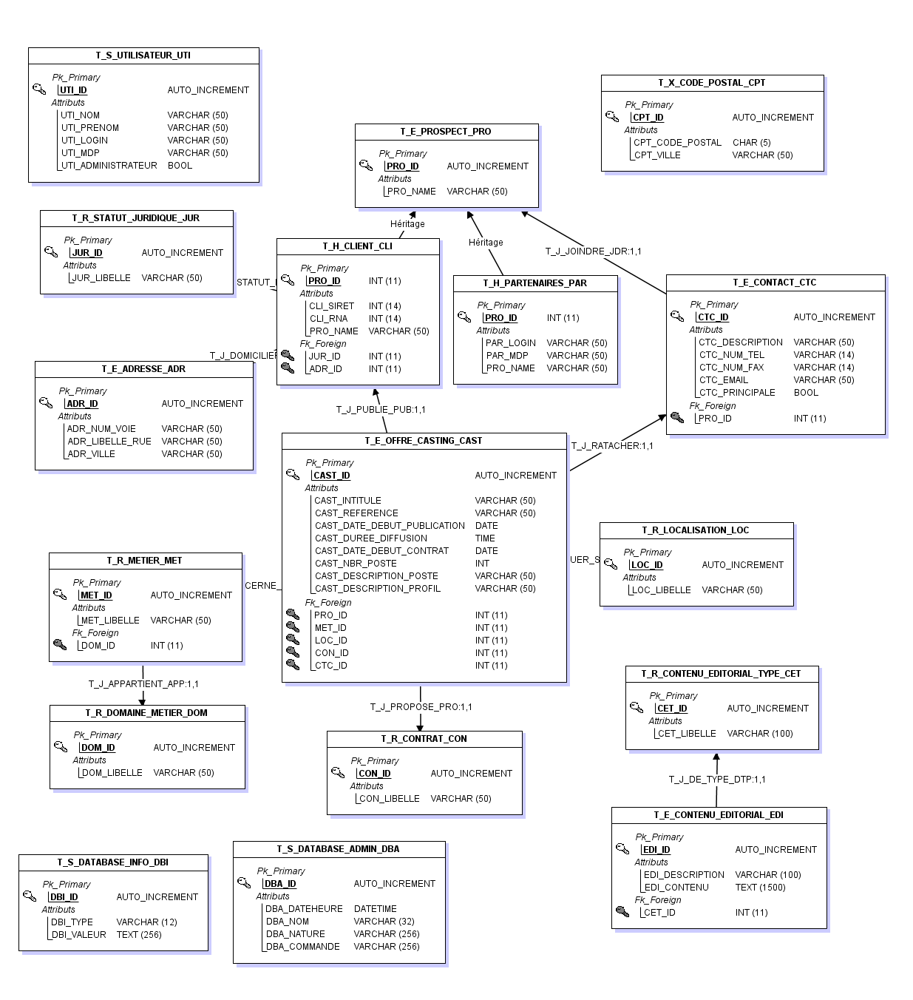

# Cahier des charges

| Numéro | Date     | responsable | descriptif                        |
| ------ | -------- | ----------- | --------------------------------- |
| 1.0.0  | 16/10/18 | S. Le Cann  | Création du document              |
| 1.0.1  | 16/10/18 | S. Le Cann  | Rédaction des principales parties |
| 1.0.1  | 21/10/18 | B. Ragot    | Review et modification générales  |

## Contexte et problématiques

### Contexte

La société MégaProduction souhaite mettre en place un point de rencontre entre professionnels et artistes dans le cadre de la recherche de casting. Afin de répondre à ce souhait, ils veulent mettre en place une plateforme complète comprenant un backoffice de gestion des annonces, un site internet multi-support de consultation professionnel et digne de confiance et la mise à disposition d'un flux de casting.

Les équipes de MegaCastings effectue des recherches de casting au près d'un réseau de partenaire. Les professionnels souhaitant publier des annonces de casting seront contactés par les équipes de MegaCastings pour vérifier la véracité des informations fournies. Différentes formules tarifaires seront proposés sous la forme de pack de x Castings.

Les artistes souhaitant voir les annonces le feront via le site internet et contacteront les professionnel en direct. Les annonces seront crées par les équipes de MegaCastings à l'aide d'un client lourd. Un professionnel pourra récupérer ses annonces à travers un flux de casting.

### Problématiques

- Mises à disposition des annonces sur un site internet multi-plateforme
  - Mises en places d'un moteur de recherche.
- Mises à disposition d'un flux de casting pour les partenaires
  - Sécurisation de l'accès au flux par authentification.
- Gestion des castings à l'aide d'un client lourd
  - Afficher, ajouter, éditer, supprimer les clients, les partenaires de diffusion et les offres de castings d'une interface simple et intuitive
- Mises en place d'une base de donnée pour stocker
  - Des clients (organisations à la recherche d'artiste)
  - Des partenaires de diffusion
  - Des offres de casting
  - Des listes de référentiel(types de contrats, domaines de métiers, métiers)
- Importance du lien permanent entre les partenaires et megacasting quant à la diffusion des annonces.
- Traitement interne non-automatisé des annonces.

## Objectifs

- Mettre en place un client lourd accessible uniquement par les employés de l'équipe de MegaCasting et doit être simple et disponible sur tous les postes de la société.
- Les solutions doivent être ergonomique.
- Le site doit être seulement en consultation.
- Mise en place d'une API RestFull pour les partenaires.
- Mise en place d'un serveurWeb.
- Mise en place d'un serveur de base de données.

## Contraintes

Le client lourd doit être disponible sur tous les postes de la société et être adapté à un fonctionnement à long terme.

## Fonctionnalités détaillées

### Client lourd

Le client lourd doit permettre de réaliser les actions suivantes à l'aide d'un interface simple et intuitive :

- Espace membre pour s'authentifier
- Gérer les prospects
  - Afficher
  - Ajouter
    - Faire devenir partenaire
    - Faire devenir client
    - Gérer les informations clients
    - Gérer les informations partenaires de diffusion
    - Gérer les informations utilisateurs
  - Éditer
    - Faire devenir partenaire
    - Faire devenir client
    - Gérer les informations clients
    - Gérer les informations partenaires de diffusion
    - Gérer les informations utilisateurs
  - Supprimer
- Gérer les utilisateurs
  - Afficher
  - Ajouter
  - Éditer
    - Rendre inactif
    - Passer en administrateur
  - Supprimer
- Gérer les offres des castings
  - Afficher
  - Ajouter
  - Éditer
  - Supprimer
- Gérer le contenu éditorial
  - Gérer le contenu
    - Afficher
    - Ajouter
    - Éditer
    - Supprimer
- Gérer les listes de référentiel
  - Rechercher un type de contrat
  - Gérer les types de contrats
    - Afficher
    - Ajouter
    - Éditer
    - Supprimer
  - Gérer les métiers
    - Afficher
    - Ajouter
    - Éditer
    - Supprimer
  - Gérer les domaines de métier
    - Afficher
    - Ajouter
    - Éditer
    - Supprimer
  - Gérer les status juridiques
    - Afficher
    - Ajouter
    - Éditer
    - Supprimer
  - Gestion de l'interface, couleur, thème

### Client léger

- Visualiser les offres de casting
- Rechercher des offres de casting
- Visualiser le contenu éditorial  

## Api privée

Utilisé par l'API publique et le client lourd. Elle doit permettre d'accèder à toutes les ressources nécessaire sur la base de données et permettre de les créer, les modifiers et les supprimer

Il faut s'authentifier sur l'API pour la consommer.

- Prospects
- Clients
- Partenaires
- Offres de castings
- Adresses
- Contacts
- Contrats
- Domaines de métiers
- Localisations
- Métiers
- Statuts juridique
- Utilisateurs
  
Elle respectera la convention REST pour les routes d'accès à l'API

## Api publique

l'API publique met à disposition des partenaires identifiés auprès de MegaCasting, un flux de diffusion qui reprendra toutes les informations relative aux fiches de castings. Ce flux sera fournis par une API REST sous format JSON et pourra être consommé par les partenaires de diffusions, afin de leur simplifier l'accès aux données.

Il faut s'authentiier sur l'API pour la consommer

Utilisé par le client léger et les partenaires

- Récupérer les flux de castings
- Authentifier un utilsateur

## Client web

Le site internet doit dynamiquement exploiter la base de données de MegaCasting, afin de mettre en avant les offres de castings.
Le design doit être clair et intuitif et permettre de naviguer de façon adapté depuis tablette et mobile.

Les fiches de castings doivent faire paraitre en plus des informations relative au casting, les informations suivantes :

- URL du site internet du partenaire
- Email
- Téléphone
- Fax ou adresse postale

Ces informations sont publique et peuvent être visible par tout le monde.

Le site internet devra aussi intégrer un moteur de recherche qui permettra de rechercher rapidement les offres de castings qui correspondent aux profils des artistes.

Le site internet doit permettre de visualiser le contenu éditorial de megacasting.

## Serveur de base de données

La base de données, installé sur un serveur dédié doit être robuste et garantir l'intégrité des données.

Les données contenues dans la base de données contiendrons les informations suivantes :

La base de données doit permettre de :

- Stocker les données
  - Des prospects
  - Des clients (organisations à la recherche d’artiste)
  - Des partenaires de diffusion
  - Des offres de casting
  - Des listes de référentiel (types de contrat, domaines de métier, métiers, catégories ...)
  - contenu éditorial
  - adresses
  - contacts
  - Des utilisateurs

### Différentes tables

