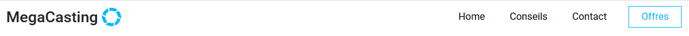
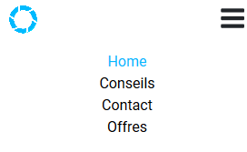
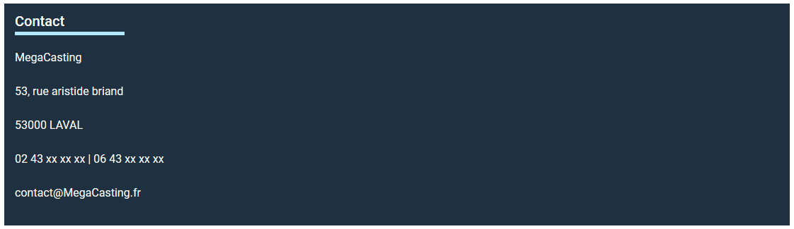
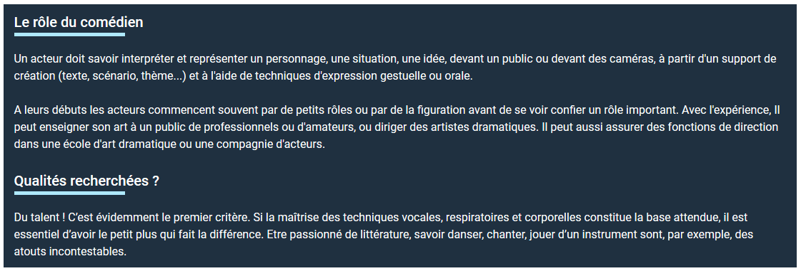
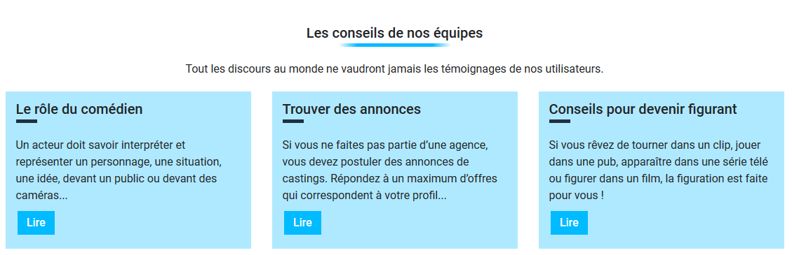
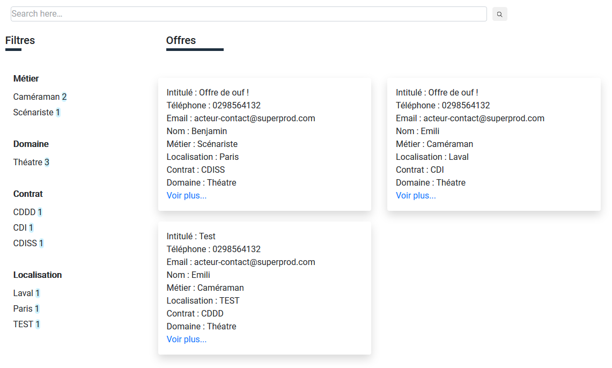
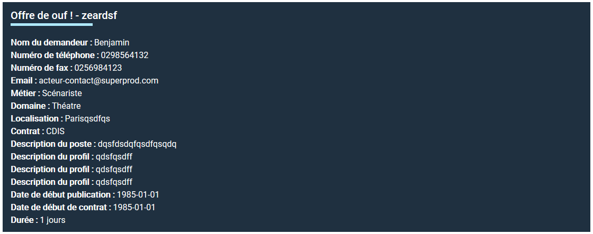
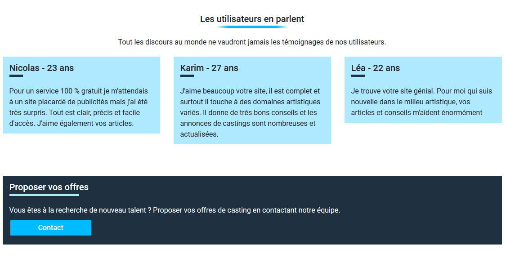
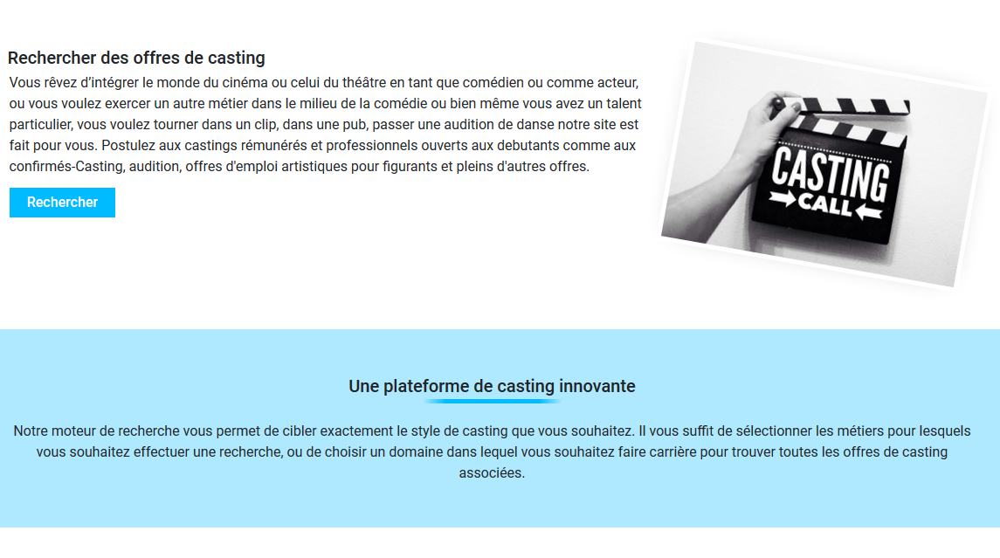
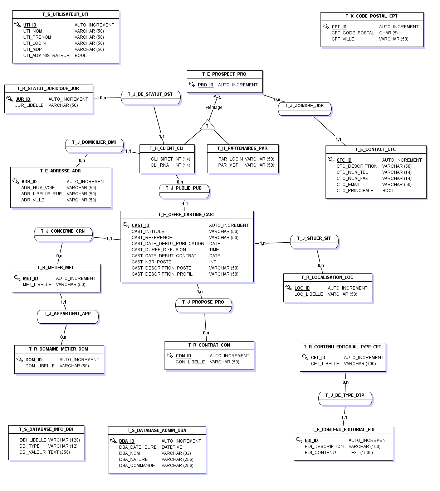

# Documenation Technique client léger

## Identification du document

| Nature du document      | Nom du fichier   | Format    |
| ----------------------- | ---------------- | --------- |
| Documentation technique | MegaCastingLeger | Pdf et md |

## Versionnage

| Numéro | Date     | responsable | descriptif           |
| ------ | -------- | ----------- | -------------------- |
| 1.0.0  | 08/01/19 | B. Ragot    | Création du document |

## Sommaires

- [Documenation Technique client léger](#documenation-technique-client-l%C3%A9ger)
  - [Identification du document](#identification-du-document)
  - [Versionnage](#versionnage)
  - [Sommaires](#sommaires)
  - [Technologies](#technologies)
  - [Cycle de vie](#cycle-de-vie)
  - [Dépendances](#d%C3%A9pendances)
  - [Architecture](#architecture)
  - [Cas d'utilisation](#cas-dutilisation)
  - [Configuration](#configuration)
    - [API publique](#api-publique)
    - [Configuration Algolia (instantsearch)](#configuration-algolia-instantsearch)
  - [Déploiement](#d%C3%A9ploiement)

## Technologies

- ReactJs
  - Package
    - Axios (Cnnection à l'api)
    - intersection-observer (Compatibilité tablette et safari)
    - instantsearch (Package algolia)
    - react-responsive-navbar (NavBar responsive)
    - Radium (Rendu css)
    - Router (Routage)
  - Syntaxe
    - Ecmascript 6
    - JSX
- Heroku (Hébergement et build)
  
- HTML 5
- CCS 3
  - Bootstrap

## Cycle de vie

1. Chargement d'un container app

     1. Chargement du component (stateless) nav bar
     2. Chargement du container (statefull) content
     3. Chargement du component (stateless) footer

2. Chargement du component nav bar.

    

      Diverses boutons (components) qui permettent via des NavLink de dire au container content quelle container charger.

      La Navbar est totalement responsive grâce à react-responsive-navbar qui sert à faire apparaître le bouton pour dérouler le menu.

    

4. Chargement du container content.

    Il s'occupe du routage. Il charge un container spéciale en fonction du path.

    ```html
      <Switch>
          <Route path="/contact" exact component={Contact} />
          <Route path="/advices/figurant" exact component={Figurant} />
          <Route path="/advices/casting" exact component={Casting} />
          <Route path="/advices/actor" exact component={Actor} />
          <Route path="/advices" exact component={Advices} />
          <Route path="/offers/:id" component={FullOffer} />
          <Route path="/offers" exact component={Offers} />
          <Route path="/" exact component={Home} />
          <Route render={() => <div className="container"><h1>Not found</h1></div>}/>
      </Switch>
    ```

    - contact

      
    
    - advices/figurant, advices/casting, advices/actor

      Il s'agit de toutes les routes de contenu éditorial.

      

    - advices

      Sommaire du contenu éditorial

      

    - offers

      Chargement de toutes les offres à partir de l'api de algolia. Filtre à gauche multi select et dynamique. Infinite scroll quand l'on descend. Une search bar qui tient compte des fautes et charge dynamiquement les offres. Utilisation de instant search et de certains components:

        - Offer (Offre)
        - InfinitHits (Chargement des offres en infini)
        - Refinement (Filtre avec style et comportement personnalisé)
        - Uniform Grid / Box / Bandeau (présentation)
        - Contrôle propre à instant search...


      

    - offers/:id

      Chargement d'une offre avec axios sur l'api publique.

      

    - Home

      Page d'accueil avec des informations sur megaCasting.

      
      

5. Chargement du footer

  

## Dépendances

  Les containers ne peuvent pas être utilisés seuls cependant une majorité des components peuvent être réutilisés dans toutes les pages du site (hormis la navbar.)

## Architecture

  - Données

    

  - Front

    Containers non génériques.

    - App.js
      - Navbar.js
        - Button.js
        - Logo.js
      - Content.js
        - Offers.js
          - Refinement.js
          - InfiniteHits.js
            - UniformGrid.js
          - Title.js
          - Box.js
        - Home.js
          - Bandeau.js
          - Title.js
          - ImageSide.js
          - Button.js
          - UniformGrid.js
          - Box.js
        - FullOffer.js
          - axios.js
          - Box.js
          - Title.js
        - Contact.js
          - Box.js
          - Title.js
        - Advices.js
          - Box.js
          - Title.js
          - Bandeau.js
          - UniformGrid.js
          - Button.js

## Cas d'utilisation

- Utilisateur
    - Visualiser les offres de casting
    - Recherche un casting
        - Include: Saisie d'un mot clé
        - Choisir une catégorie particulière pour filtre
    - Visualiser le contenu éditorial
        - Extends: Filtré par catégorie
    - Visualiser une page Home

## Configuration

### API publique

  le lien de l'api publique.

  ```js
    import axios from 'axios';

    const instance = axios.create({
    baseURL: 'https://megacastingpublicapi.azurewebsites.net'
    });
  ```

  Configuration d'une reqûete

  ```js
    import axios from '../../../axios';

    axios.get( '/offreCastings/' + match.params.id )
                    .then( response => {
                        this.setState( { loadedPost: response.data } );
                    } );
  ```

### Configuration Algolia (instantsearch)

  ```html
    <InstantSearch
                appId="9FGBZNOUZ3"
                apiKey="92286c5a9399bf30ccceb915cd308ad6"
                indexName="offreCastingsFormated"
            >

      <Configure hitsPerPage={12} />

      <InfiniteHits minHitsPerPage={12} hitComponent={Offer} />
  ```

## Déploiement

  L'application étant en intégration continue il suffit de faire un push vers la branche Master. Heroku ce chargera de venir récupérer le dépot et de le build.

  Attente : 2/3 minutes le temps pour heroku de redémarrer le serveur et de build l'applciation.


  

