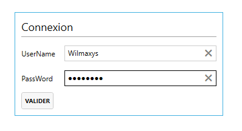
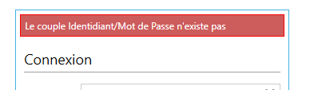
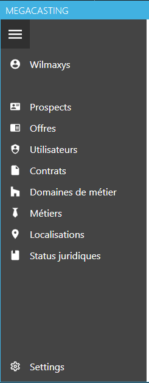
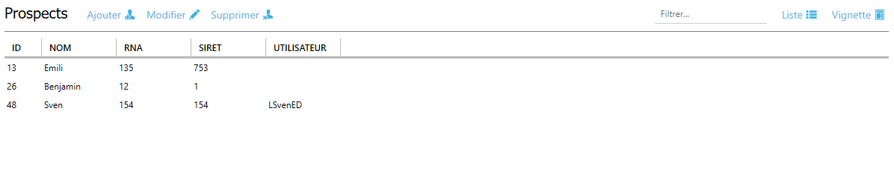
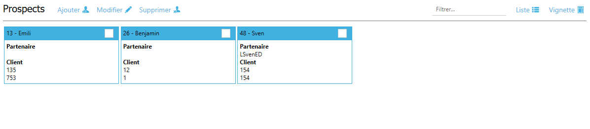
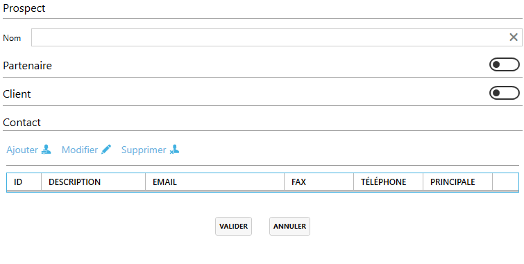
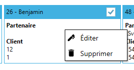
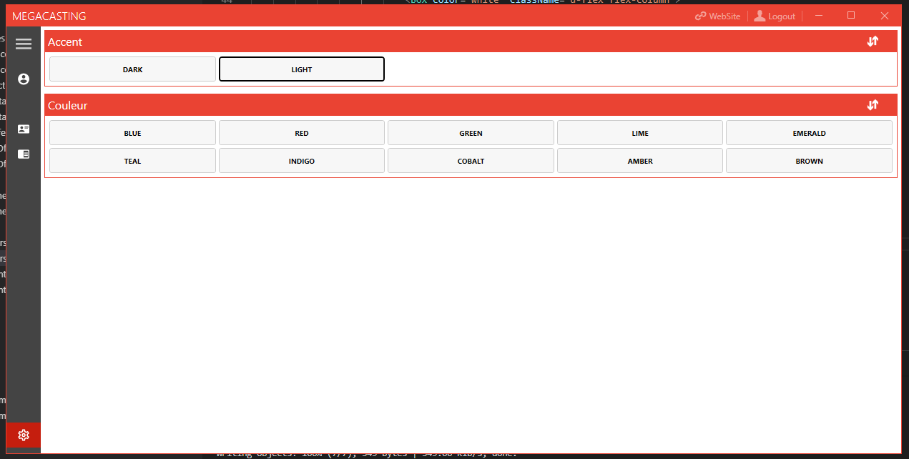
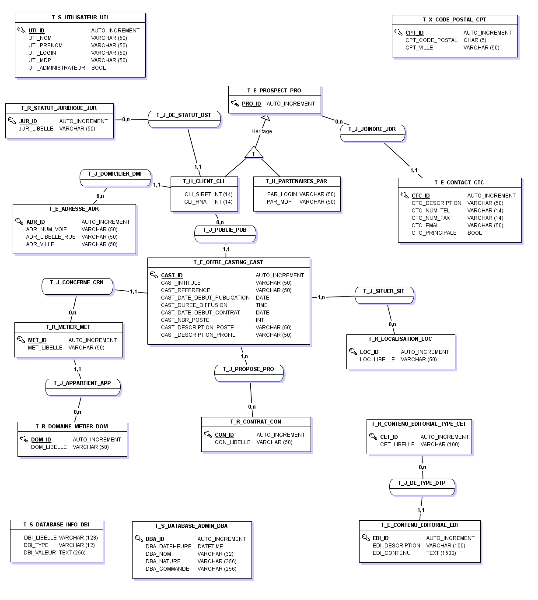

# Documenation Technique client lourd

## Identification du document

| Nature du document      | Nom du fichier   | Format    |
| ----------------------- | ---------------- | --------- |
| Documentation technique | MegaCastingLourd | Pdf et md |

## Versionnage

| Numéro | Date     | responsable | descriptif           |
| ------ | -------- | ----------- | -------------------- |
| 1.0.0  | 08/01/19 | B. Ragot    | Création du document |

## Sommaires

- [Documenation Technique client lourd](#documenation-technique-client-lourd)
  - [Identification du document](#identification-du-document)
  - [Versionnage](#versionnage)
  - [Sommaires](#sommaires)
  - [Technlogies](#technlogies)
  - [Cycle de vie](#cycle-de-vie)
    - [Autres](#autres)
  - [Spécificités](#sp%C3%A9cificit%C3%A9s)
  - [Dépendances](#d%C3%A9pendances)
  - [Architecture](#architecture)
    - [Composants](#composants)
    - [Données](#donn%C3%A9es)
  - [Cas d'utilisation](#cas-dutilisation)
  - [Configuration](#configuration)
  - [Déploiement](#d%C3%A9ploiement)

## Technlogies

- C#
  - WPF (Interface)
  - MahApps Metro
    - IconPacks
  - Linq
  - NewtonSoft.Json

## Cycle de vie

- Connexion au client lourd

    

    Peut refuser une connexion:

    

    Génération du token API

- Chargement du userControl Home.

- Chargement des menus accessible à l'utilisateur.

  Vérification du statut:

    - Administrateur

      

    - Utilisateur

      

- Chargement des différentes vues sur ce modèle dans userControl

    1. en liste 
        
        
    
    2. En vignette

        

    Chargement de l'interface grâce à la liste fournit par l'api.

- Possibilité d'édition, ajout et supression.

  Ouverture d'un écran.

  

- Menu contextuel.

  

- Filtre

  Par nom ou libellé.

  

- Déconnexion et ouverture du site web

  

- Changement de la couleur

  

### Autres

  - Au chargement de l'application, pré-chargement de toutes les vues.
  - Reload des listes à chaque changement.
  - Action de l'API dans les models pour pouvoir éditer de n'importe ou dans l'appli.
  - Changement de couleur grâce à mahapps.

## Spécificités

- APIObject

  Object de manipulation d'un type de données dans l'API.

- MegaCastingEntities

  Banque d'API Object instancié.

- MegaCastingDatabase

  Instance de communication avec la base de donnée.

## Dépendances

- MahApps Metro
  - IconPacks
- NewtonSoft.Json
- .NET FrameWork

## Architecture

### Composants

- Main Window
  - UserControl Home
    - UserControl Content
      - View
        - ViewModel
          - Rule
          - DataDictionnary
          - Model
            - Action
          - Liste
          - RelatedList
          - Vignette
- Edit Windows
  - Windows Model
    - StoreObject
      - RelatedList
  - Rule
  - DataDictionnary

### Données

  

## Cas d'utilisation

- Utilisateur
    - Rechercher une offre de casting
        - extends: Entre la valeur dans le champ de filtre
    - Gérer les offres de casting
        - extends: Ajouter
        - extends: Éditer
        - extends: Supprimer
    - Rechercher un client
        - extends: Entre la valeur dans le champ de filtre
    - Gérer les clients
        - extends: Ajouter
        - extends: Éditer
        - extends: Supprimer
    - Rechercher un partnaire de diffusion
        - extends: Entre la valeur dans le champ de filtre
    - Gérer les partenaires de diffusion
        - extends: Ajouter
        - extends: Éditer
        - extends: Supprimer
    - Rechercher un type contrat
        - extends: Entre la valeur dans le champ de filtre
    - Gérer les types contrats
        - extends: Ajouter
        - extends: Éditer
        - extends: Supprimer
    - Rechercher un métier
        - extends: Entre la valeur dans le champ de filtre
    - Gérer les métiers
        - extends: Ajouter
        - extends: Éditer
        - extends: Supprimer
    - Rechercher domaine de métier
        - extends: Entre la valeur dans le champ de filtre
    - Gérer les domaines de métier
        - extends: Ajouter
        - extends: Éditer
        - extends: Supprimer
    - Rechercher statut juridique
        - extends: Entre la valeur dans le champ de filtre
    - Gérer les status juridiques
        - extends: Ajouter
        - extends: Éditer
        - extends: Supprimer
    - Rechercher une localisation
        - extends: Entre la valeur dans le champ de filtre
    - Gérer les localisations
        - extends: Ajouter
        - extends: Éditer
        - extends: Supprimer
    - Rechercher un utilisateur
        - extends: Entre la valeur dans le champ de filtre
    - Gérer les utilisateurs
        - extends: Ajouter
        - extends: Éditer
        - extends: Supprimer
    - Gérer le style


## Configuration

  - Lien de l'api.
    ```csharp
      const string PATH = "https://megacastingprivateapi.azurewebsites.net";
    ```

  - Path de chaque type de donnée.
    ```csharp
      this.T_E_ADRESSE_ADR = new APIObject<T_E_ADRESSE_ADR>(PATH + "/adresses");
      this.T_E_CONTACT_CTC = new APIObject<T_E_CONTACT_CTC>(PATH + "/contacts");
      this.T_E_CONTENU_EDITORIAL_EDI = new APIObject<T_E_CONTENU_EDITORIAL_EDI>(PATH + "/contenus");
      this.T_E_OFFRE_CASTING_CAST = new APIObject<T_E_OFFRE_CASTING_CAST>(PATH + "/offreCastings");
      this.T_E_PROSPECT_PRO = new APIObject<T_E_PROSPECT_PRO>(PATH + "/prospects");
      this.T_H_CLIENT_CLI = new APIObject<T_H_CLIENT_CLI>(PATH + "/clients");
      this.T_H_PARTENAIRES_PAR = new APIObject<T_H_PARTENAIRES_PAR>(PATH + "/partenaires");
      this.T_R_CONTRAT_CON = new APIObject<T_R_CONTRAT_CON>(PATH + "/contrats");
      this.T_R_DOMAINE_METIER_DOM = new APIObject<T_R_DOMAINE_METIER_DOM>(PATH + "/domainemetiers");
      this.T_R_LOCALISATION_LOC = new APIObject<T_R_LOCALISATION_LOC>(PATH + "/localisations");
      this.T_R_METIER_MET = new APIObject<T_R_METIER_MET>(PATH + "/metiers");
      this.T_R_STATUT_JURIDIQUE_JUR = new APIObject<T_R_STATUT_JURIDIQUE_JUR>(PATH + "/statutjuridiques");
      this.T_S_UTILISATEUR_UTI = new APIObject<T_S_UTILISATEUR_UTI>(PATH + "/utilisateurs");
    ```

## Déploiement

  Une fois configuré il suffit de livrer sur chaque poste l'éxécutable.


  

