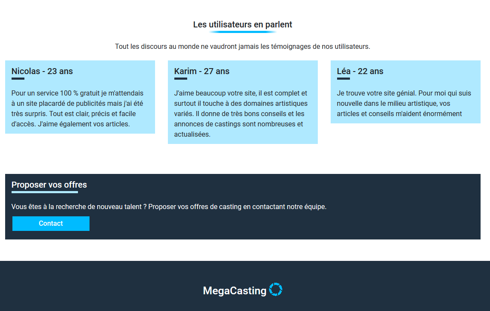
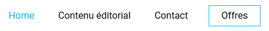
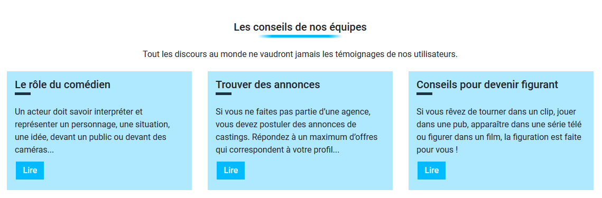
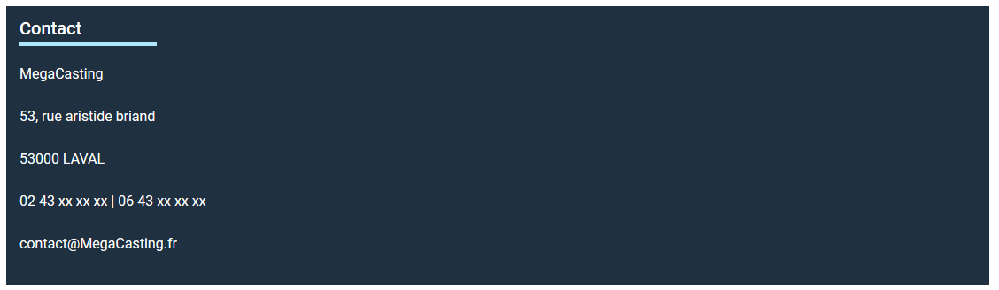
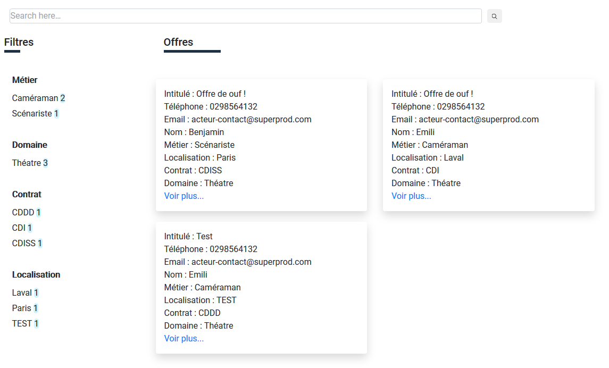
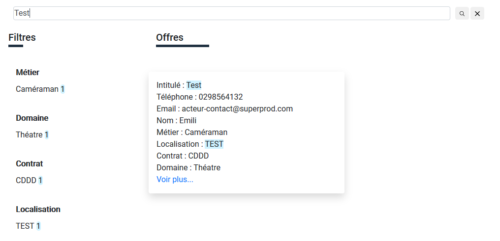
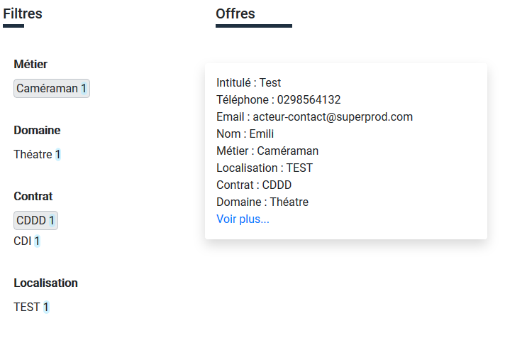
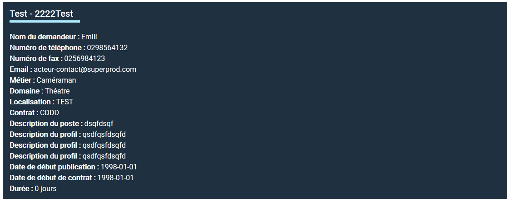

# Documenation Utilisateur client leger

## Identification du document

| Nature du document      | Nom du fichier   | Format    |
| ----------------------- | ---------------- | --------- |
| Documentation utilisateur | MegaCastingLeger | Pdf et md |

## Versionnage

| Numéro | Date     | responsable | descriptif           |
| ------ | -------- | ----------- | -------------------- |
| 1.0.0  | 08/01/19 | B. Ragot    | Création du document |

## Sommaires

- [Documenation Utilisateur client leger](#documenation-utilisateur-client-leger)
  - [Identification du document](#identification-du-document)
  - [Versionnage](#versionnage)
  - [Sommaires](#sommaires)
  - [Utilisation](#utilisation)
    - [Page Home](#page-home)
    - [Contenu éditorial](#contenu-%C3%A9ditorial)
    - [Contact](#contact)
    - [Offres](#offres)

## Utilisation

### Page Home

  Diverses informations utiles sur le site.

  
  

### Contenu éditorial

1. Aller dans Contenu éditorial
  
2. Visualer le contenu éditorial disponible.
  
3. Cliquer sur lire pour ouvrir un contenu
  

### Contact

1. Aller dans contact
  
2. Visualiser les différentes informations de contact
  

### Offres

1. Aller dans offres
  
2. Cherche une offre
   1. Taper un texte dans la barre de recherche
    
    Il y a une surbrillance sur les occurences. Une prise en compte des fautes d'orthographe. Un rafraîchissement automatique et des filtres et du contenu.
   2. Pour enlever le filtre cliquer sur la croix.
   3. Cliquer sur un filtre

      Il passe en encadré.
      
      Le contenu est dynamiquement mis à jour.
    4. Cliquer sur le filtre que vous voulez enlever pour qu'il ne soit plus pris en compte.
3. Cliquer sur **Voir plus...** pour ouvrir une offre en particulier
  

  

