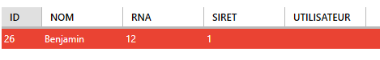

# Documenation Utilisateur client lourd

## Identification du document

| Nature du document      | Nom du fichier   | Format    |
| ----------------------- | ---------------- | --------- |
| Documentation utilisateur | MegaCastingLourd | Pdf et md |

## Versionnage

| Numéro | Date     | responsable | descriptif           |
| ------ | -------- | ----------- | -------------------- |
| 1.0.0  | 08/01/19 | B. Ragot    | Création du document |

## Sommaires

## Utilisation

### Connexion

- Entrer votre indentifiant et mot de passe.

  

  Vous allez être rediriger vers la page d'accueil.

### Déconnexion

- Cliquer sur logout

  

### Menu

- Menu condensé
  

- Appuyer sur les troits traits pour étendre le menu

  

  Menu disponible:

  - Votre nom d'utilisateur (non cliquable)
  - gestion des prospects
  - gestion des offres
  - gestion utilisateurs (Administrateur seulement)
  - gestion des contrats (Administrateur seulement)
  - gestion des domaines de métiers (Administrateur seulement)
  - gestion des métiers (Administrateur seulement)
  - gestion des localisations (Administrateur seulement)
  - gestions des status juridiques (Administrateur seulement)
  - Settings
  

### Pages disponible pour tout le monde

#### Prospects

- Recherche par nom
  - Taper le nom dans le champs de filtre
  - Appuyer sur **Entrée**
  
  
  

- Éditer ou ajouter un utilisateur
  - Sélectionner un utilisateur
    
  - Cliquer sur le bouton Ajouter / Modifier
    
    - Entrer les information
    - Cliquer les slides pour faire devenir client ou partenaire
      
    - Enter les informations
      
    - Ajouter des contact si nécessaire
      

      Procédure sensiblment la même que pour le prospect. Une nouvelle fenêtre s'ouvre et vous devez renseigner les informations puis valider.
      
      
    - Valider ou annuler
      
      

- Supprimer
  - Sélectionner une offre
  - Appuyer sur Supprimer

#### Offres

- Recherche par nom
  - Taper le nom dans le champs de filtre
  - Appuyer sur **Entrée**
  
  
  

- Éditer ou ajouter une offre
  - Cliquer sur ajouter / modifier
    - Entrer les informations
      
    - Corriger les erreurs si besoins
    - Valider
      

### Tips

- Changement de couleur
- Lien vers le site

  

