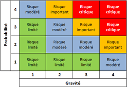

# FAQ

- Faire un sous-domaine sur le client léger pour que les partenaires de diffusions puissent demander leur clé d'authentifcation à l'api ? (ex: api.megacasting.com)

- Pour l'authentification à l'api, il faut envoyer une première requête qui envoie une clé temporaire qui donne accès au reste de l'api mais dont on peut gérer la durée de vie.

- Les tables ne devraient pas être décrite dans le cahier des charges, elles vont êtres décrites dans le dossier fonctionnelle(analyse détaillé) non ?

- Le contenu éditorail doit pouvoir être affiché sur le client lourd ?

- Le contenu éditorial est bien ajouté dans le client lourd ?

- Fait on des catégories de contenu éditorial ?

- Fait on des catégories d'offre de casting ?

- Qu'est-ce qu'un client ? Organisations à la recherche d’artiste.

- Doit-on ajouter les fonctionnalités proposés ?

- Lotissement / évaluation des risques Késako ?
    
- Quel contenu dans les fiches métiers ?

- Quelles sont les différents types de contrat dans le monde l'audio visuel ? Une offre peut-elle être associée à plusieurs contrats différents ?

- Demander uns liste de domaine de métier et de métier.

- Es-ce qu'une offre correspond à un seul type de contrat ? A modifier si jamais oui.

- Les coordonnées de contact pour postuler à une offre peuvent-il être différent des coordonnées de contact pour contacter le client ?