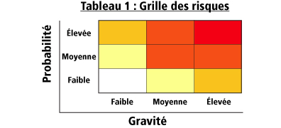

# Questions posées au client

## Mail

Hiron Dorian le 18/10/2018

Q: Quel est l'état actuelle de l'infrastructure ? Y a t'il des matériels que l'on peut réutiliser ? ( Serveur web, base de données ). Devont nous mettre en place une nouvelle infrastructure dans le cadre du déployement de la solution MegaCasting ?
R: C'est qui est représenté c'est que le serveur de base de données et web sont dissociés, pour le reste vous pouvez imaginer la solution souhaitée mais elle doit être à la hauteur d'une solution d'un contexte d'entreprise.

Q: Quand est t'il de la contrainte d'adaptibilité à un fonctionnement à long terme ? Certaines technologie doivent elles être évitées ?
R: À vous de juger et défendre vos choix !

Q: Un exemple de liste de référentiels ?
R: Type de contrat : CDD, CDI, Stage, Alternance...

Q:  Lotissement / évaluation des risques Késako ?
R:  Découper le projet en plusieurs lots dans le but d'organiser le travail au niveau des ressources/équipe/échéance. Par exemple, d'abord le client lourd puis le site, possible de découper encore plus finement par fonctionnalité : API, moteur de recherche, maquette, etc.
  

Q: Client lourds accès aux données de la base de données par une API ou par connexion directe à la base de données ? Qu'est-ce qui est le plus pertinent ?
R: Instinctivement j'aurais voté pour l'accès direct mais l'API est une bonne idée et elle serait mutualisable avec le site. Idem, libre à vous.

Hiron Dorian le 13/11/2018

Q: Es-ce qu'un client peut aussi être partenaire ?

R: Oui.